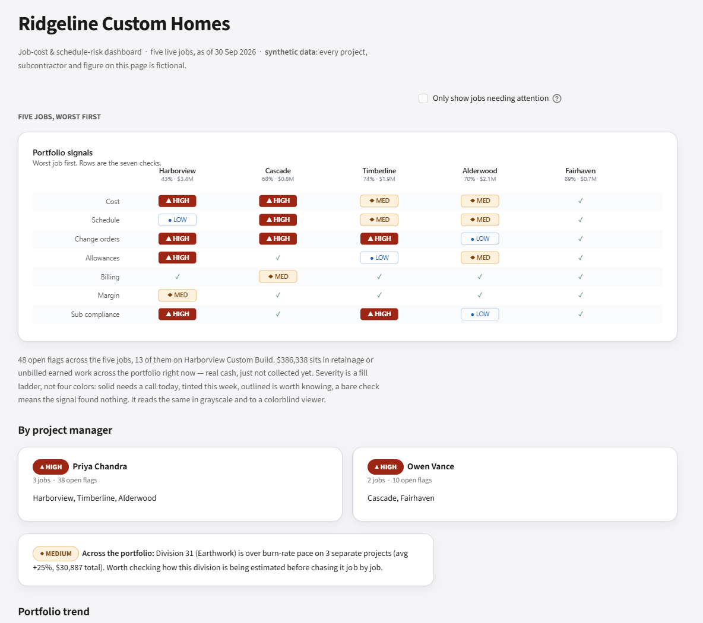
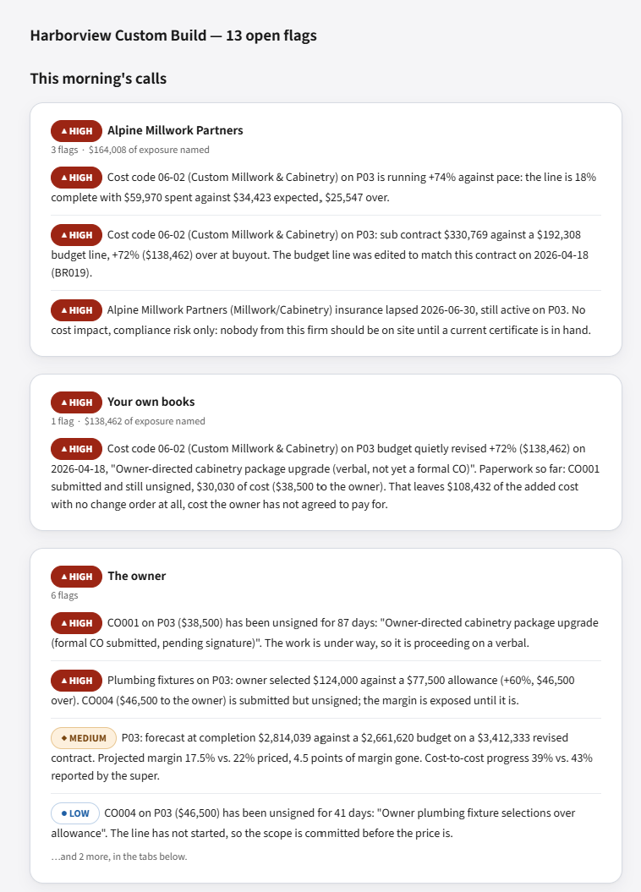

# Job-Cost & Schedule-Risk Dashboard

**Portfolio-level construction controls for identifying which project needs management intervention, why, and what action should happen next.**

[Live dashboard](https://job-cost-risk-dashboard.streamlit.app/) · [Technical reference](docs/TECHNICAL_REFERENCE.md) · [Tests](https://github.com/NathanTaylorOps/job-cost-risk-dashboard/actions/workflows/tests.yml)

## Operating problem

A construction manager responsible for several simultaneous projects needs more than individual cost reports. Unapproved variations, accelerating trade costs, late selections, schedule slippage, unbilled work and expired subcontractor credentials can create exposure before the monthly financial review reveals it.

This application consolidates those signals into a **worst-first portfolio view**, supported by project drill-downs and a practical follow-up list. It is designed around a recurring operational decision: **which job needs a call this morning?**



*Portfolio overview — fictional demonstration data, with higher-priority projects shown first.*

## What the dashboard provides

| Management question | Dashboard capability |
| --- | --- |
| Where should attention go first? | Five-project, seven-signal severity grid and project-manager rollups |
| Is spending tracking the actual work delivered? | Cost-code burn-rate checks, materiality thresholds and budget-change detection |
| Are commitments and owner approvals aligned? | Buyout comparisons, change-order aging and cost-versus-sell reconciliation |
| Are delivery dates and profit still credible? | Critical-path schedule slip, SPI/CPI and line-by-line cost-at-completion forecasts |
| Is cash or contractual exposure building? | Earned-but-unbilled value, retainage, late selections and subcontractor compliance |
| What action should be recorded? | Session-based call list with checkboxes, notes and CSV/PDF export |

Thresholds can be adjusted within the dashboard. The same checks can run against an uploaded portfolio using the documented 11-CSV schema.

## Demonstration scenarios

The supplied Ridgeline Custom Homes portfolio is **fully synthetic and deliberately seeded with detectable issues**:

- **Harborview Custom Build:** a cabinetry scope change connects budget revisions, subcontract commitments, unsigned change-order coverage, insurance status and forecast margin.
- **Cascade Ridge:** weather and changed conditions affect forecast completion; a potential duplicate framing draw deserves investigation before the next payment.
- **Fairhaven:** a deliberately clean project tests whether the dashboard can distinguish normal operations from exceptions.
- **Portfolio-wide:** recurring earthwork overruns illustrate exposure that can be more consequential across several jobs than on any one project.



*Project detail — related cost, contractual and compliance warnings grouped into actionable conversations.*

Flags can share a root cause; **flag amounts must not be added together as a financial-loss estimate.** The output supports investigation and prioritisation, not automatic conclusions about fault or payment legitimacy.

## How to run

Requires Python 3.11+.

```bash
git clone https://github.com/NathanTaylorOps/job-cost-risk-dashboard.git
cd job-cost-risk-dashboard
python -m pip install -r requirements.txt
streamlit run app/streamlit_app.py
```

The application generates its deterministic example CSVs on first run. For a direct inspection of the flags:

```bash
python src/detection.py
```

Run the tests with:

```bash
python -m pip install -r requirements-dev.txt
pytest tests/ -v
```

CI covers Python 3.11 and 3.12, linting, application and chart tests, deterministic dataset regeneration, Streamlit startup and a browser-based accessibility audit.

## Design and operating boundaries

- **Illustrative data, not client records.** Ridgeline Custom Homes, its employees, projects, suppliers, contracts and financial figures are fictional. No real employer information is included.
- **Human judgement remains essential.** A repeated invoice may be valid, missing costs may reflect posting delays, and some warnings intentionally overlap.
- **Thresholds require local calibration.** The baseline uses documented US residential-construction assumptions and Washington State context; it is not a universal construction benchmark or a substitute for local contractual or legal review.
- **Not an integrated production system.** The upload is a validated file-based snapshot, not a live connection to accounting, payroll, ERP or project-management software. Call-sheet state is session-only.
- **Forecasts are conditional.** Results depend on reported progress, ledger completeness, schedule assumptions and the quality of source records; they are indicators for management review, not assured final outcomes.

Detailed schema requirements, calculation logic, calibration references, model assumptions and testing rationale are retained in the [technical reference](docs/TECHNICAL_REFERENCE.md). Deliberate test mutations are documented in [tests/MUTATIONS.md](tests/MUTATIONS.md).

## Related work

[BidGate](https://github.com/NathanTaylorOps/bidgate) addresses bid qualification before work is accepted. This dashboard addresses financial and delivery control once work is under way. Additional projects are available in the [operations portfolio](https://github.com/NathanTaylorOps).

## License

MIT — see [LICENSE](LICENSE).
